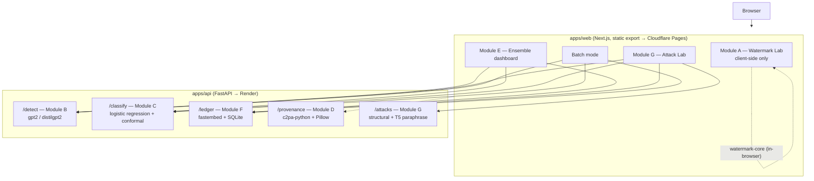

# Provenance

_(working title — may be renamed)_

A multi-method AI-content detection suite. Seven independent modules feed
one ensemble layer that shows **disagreement** between methods rather than
hiding it behind a single confidence number — and includes a module built
specifically to survive the attack that breaks almost every other
detector: paraphrasing.

This is a portfolio project. It is built and documented to be technically
credible first: real math, real tests, real evaluation numbers, no
hand-waved claims. See `docs/` for methodology and honest limitations.

## Disclaimers (read before anything else)

- **This does not detect any vendor's real production watermark or AI
  classifier.** Module A is an original, independent implementation of
  the published Kirchenbauer et al. (2023) green-list scheme and
  Aaronson's Gumbel scheme, built for education/research. It has no
  access to and cannot detect watermarks or classifiers actually used in
  production by Anthropic, OpenAI, Google, or anyone else.
- **AI-content detection is not a solved problem, and this project does
  not claim to solve it.** Module F (retrieval ledger) and the Attack Lab
  (Module G) improve robustness to paraphrasing specifically, but Module F
  only recognizes content this suite itself generated and logged — it
  cannot retroactively identify arbitrary AI text it never saw. Full
  details, including a documented base-model blind spot shared with most
  published detectors, are in [`docs/limitations.md`](docs/limitations.md).
- No copyrighted text is scraped or bundled as training/demo data anywhere
  in this project. Third-party datasets (if used) are documented with
  license and source in [`docs/dataset.md`](docs/dataset.md) and fetched
  by a setup script, never committed to the repo.

## Why this isn't just another GPTZero clone

Commercial detectors (GPTZero, Originality.ai, Copyleaks, Turnitin) all
converge on the same architecture: perplexity + burstiness + stylometry,
blended into one confidence percentage. Modules B and C here are that too
— no pretending otherwise. What's different:

- **Module F (retrieval ledger)** is structurally robust to paraphrasing,
  the one attack that reliably defeats nearly every published detector (a
  well-known result: DetectGPT's detection rate on paraphrased text
  collapses from 70.3% to 4.6% despite the paraphrase barely changing
  meaning). No consumer detector ships this.
- **Module G (Attack Lab)** lets a user run real paraphrase/adversarial
  attacks against the suite live and watch which modules survive — proof
  instead of a marketing claim.
- **Module E** reports calibrated uncertainty and per-sentence attribution
  instead of one fake-precise score.

## Status

Built in phases, one module at a time; each phase gets tests, a working UI
panel, and a commit before the next one starts. See the table in
[`docs/architecture.md`](docs/architecture.md) for the module list.

- [x] Phase 0 — Scaffold
- [x] Phase 1 — Module A: watermarking (green-list + Gumbel schemes, `/watermark`)
- [x] Phase 2 — Module A: robustness + tradeoff analysis (`/watermark/robustness`)
- [x] Phase 3 — Module F: retrieval provenance ledger (`/ledger`)
- [x] Phase 4 — Module B: zero-shot statistical detector (`/detect`)
- [x] Phase 5 — Module C: trained classifier + calibration (`/classify`)
- [x] Phase 6 — Module D: file provenance (C2PA) (`/provenance`)
- [x] Phase 7 — Module G: Attack Lab (`/attack-lab`)
- [x] Phase 8 — Module E: ensemble dashboard (`/ensemble`)
- [x] Phase 9 — Batch mode (`/batch`), benchmark page (`/benchmark`), deploy config

## Tech stack

- **Frontend**: Next.js + TypeScript + Tailwind (`apps/web`), built as a
  static export and deployed to Cloudflare Pages.
- **Backend**: Python + FastAPI (`apps/api`), for modules needing a real
  language model, embeddings, or scikit-learn. Deployed to Render;
  fully runnable via Docker Compose locally. See
  [`docs/deploy.md`](docs/deploy.md) for the full deploy steps.
- **Shared watermark core**: `packages/watermark-core`, a standalone,
  unit-tested TypeScript package with no UI dependencies.

## Quickstart

```bash
# Frontend + shared packages
npm install
npm run dev:web              # http://localhost:3000

# Backend (separate terminal) — needed for the Ledger page (Module F);
# the Watermark Lab (Module A) runs entirely client-side and doesn't need it.
cd apps/api
python3.11 -m venv .venv && source .venv/bin/activate
pip install -r requirements-dev.txt
uvicorn app.main:app --reload   # http://localhost:8000

# Or everything via Docker Compose
docker compose up
```

## Monorepo layout

```
/apps/web                 — Next.js frontend
/apps/api                 — FastAPI backend
/packages/watermark-core  — Shared TS watermarking + z-test logic
/reference                — Original prototype, porting reference only
/docs                      — Architecture, benchmark, dataset, limitations
```

### Architecture



Module A never leaves the browser (the toy watermark grammar + z-test
detector run entirely in `packages/watermark-core`); every other module is
a real network call from `apps/web` to `apps/api`. Modules E, G, and batch
mode are pure frontend orchestration over B/C/F/G's existing endpoints —
no dedicated backend route of their own (see `docs/architecture.md`).

## Live demo

Deployment is configured (Cloudflare Pages for `apps/web`, Render for
`apps/api` via the root `render.yaml`) but not yet actually deployed —
see [`docs/deploy.md`](docs/deploy.md) for the exact steps.
